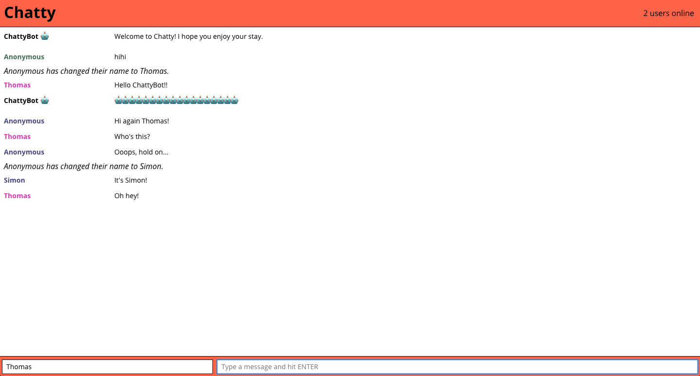

# Chatty

Chatty is a real-time chat application that was a Lighthouse Labs project and was built using React, Babel, WebPack, and websockets.  It allows multiple users to:

* chat with each other in real-time
* change their usernames and be notified when others change theirs
* post in-line photos by pasting in an image URL



### Usage

Install the dependencies and start the main server.

```
npm install
npm start
```
Start the chatty server in another terminal window.
```
cd chatty_server
npm start
```

### Dependencies

* React
* Webpack
* [babel-loader](https://github.com/babel/babel-loader)
* [webpack-dev-server](https://github.com/webpack/webpack-dev-server)
